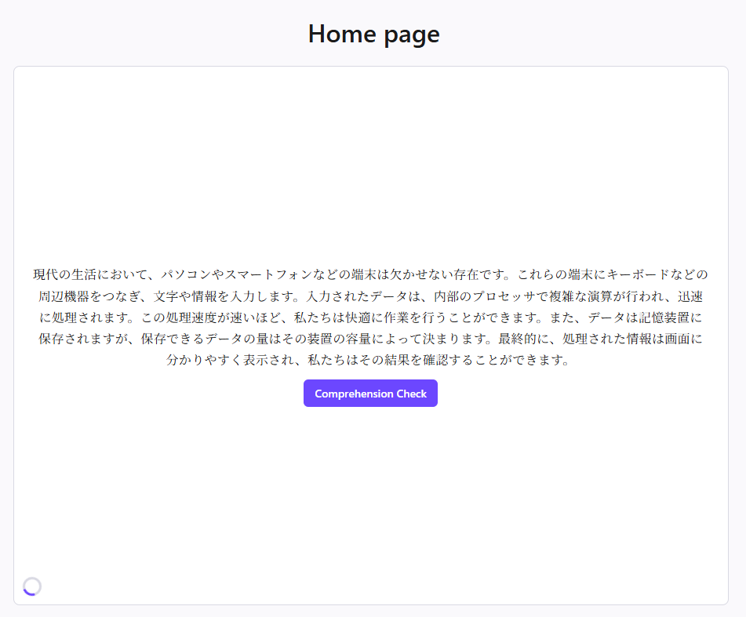
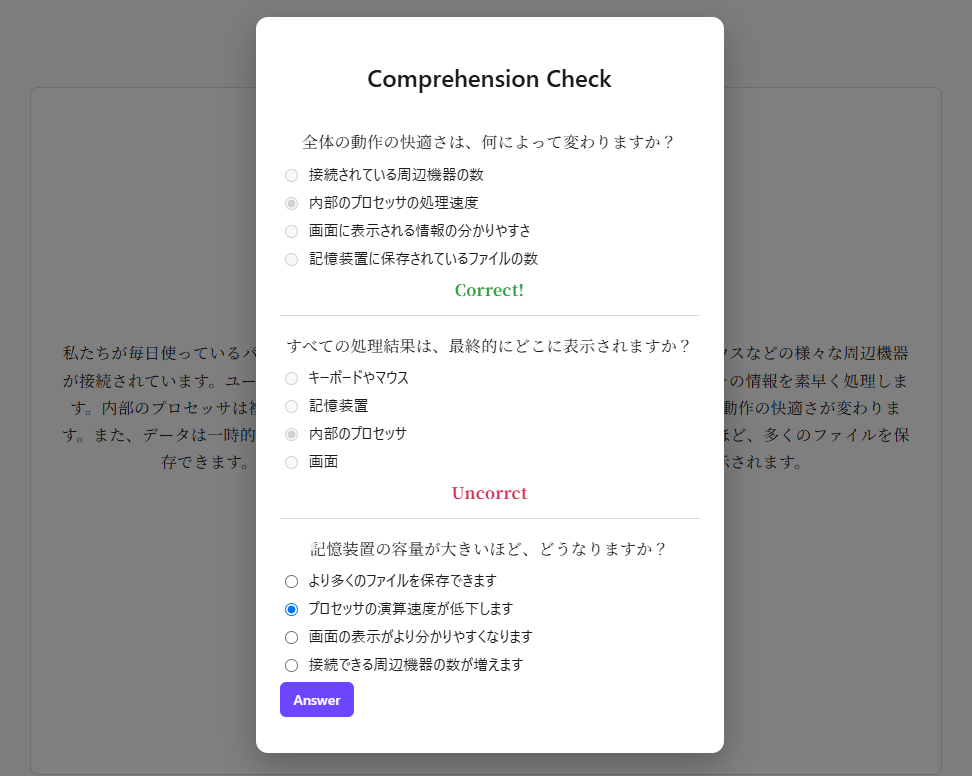
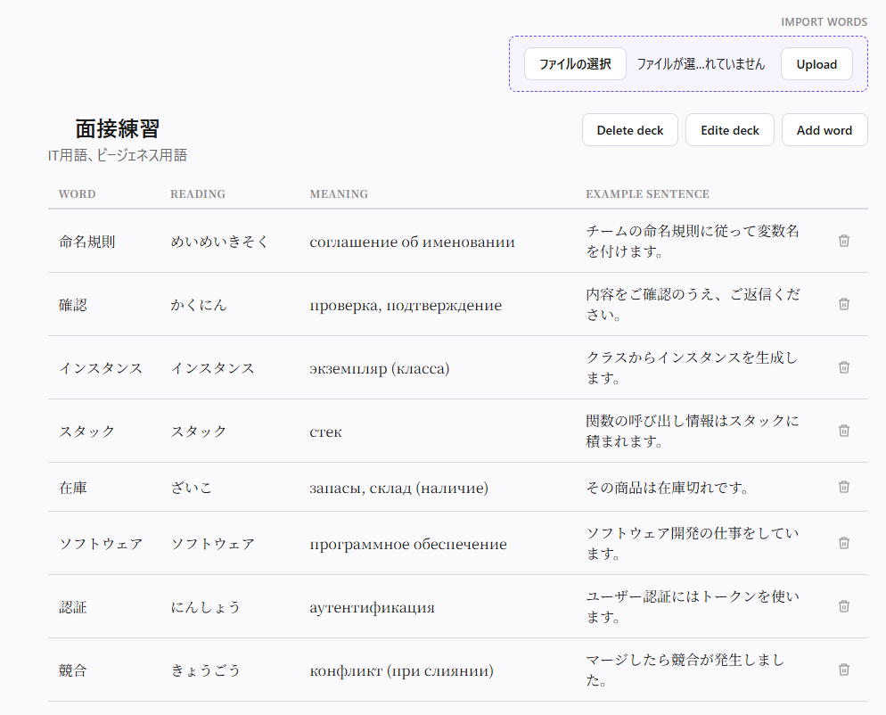

# JapaneseTextGenerator

JapaneseTextGenerator is a Japanese-learning app that turns your own vocabulary decks into short, AI-generated practice texts. You build decks of words (Anki-style), and the app writes new Japanese reading material using only the words you're actually learning — then checks how well you understood it and tracks how well you remember each word over time.

## Screenshots

**Home feed** — generated texts appear in a scrollable feed, each with a "Comprehension Check" button.

**Comprehension check** — multiple-choice questions about the text you just read, with instant right/wrong feedback.

**Deck management** — words with reading, meaning and example sentence, imported from Excel or added by hand.

## Features

- **User accounts** — register/login, all decks, texts and progress are scoped to your account.
- **Decks & words** — create decks, add words manually, or bulk-import them from an Excel file (`word / reading / meaning / example` columns).
- **AI text generation** — generates a short Japanese-only text from words picked from your deck, using a pluggable AI provider (currently Gemini; OpenAI is supported through the same interface).
- **Spaced repetition (FSRS)** — every word has its own memory model (stability, difficulty, due date). Text generation prioritizes words that are actually due for review, and a dedicated review page lets you grade your recall (Again / Hard / Good / Easy) to update that model.
- **Comprehension checks** — each generated text comes with AI-written multiple-choice questions, so you can confirm you actually understood it, not just recognized the words.
- **Infinite feed** — generated texts appear in a scrollable, snap-to-card feed on the home page; scrolling to the last text automatically requests a new one, with a loading indicator while it's generating.

## Tech stack

**Backend:** ASP.NET Core Web API (.NET 10), Entity Framework Core, PostgreSQL
**Frontend:** React 19, TypeScript, Vite

## Project structure

backend/KotobaApi/ ASP.NET Core Web API (controllers, services, EF Core models)
frontend/ React + TypeScript client
docs/ Design notes and screenshots

## Running locally

**Backend**

cd backend/KotobaApi

dotnet user-secrets set "ConnectionStrings:Default" "<your-postgres-connection-string>"
dotnet user-secrets set "Jwt:Key" "<random string, 40+ characters>"
dotnet user-secrets set "Jwt:Issuer" "<your-issuer>"
dotnet user-secrets set "Jwt:Audience" "<your-audience>"
dotnet user-secrets set "Gemini:ApiKey" "<your Google AI Studio key>"
dotnet run

The API runs on `http://localhost:5166` by default.

**Frontend**

cd frontend
npm install
npm run dev

## AI provider

The app talks to the AI provider through a single `IAiTextGenerationService` interface, so switching providers (Gemini ↔ OpenAI) only requires changing the DI registration in `Program.cs` and the corresponding config section in `appsettings.json` — no other code changes needed.

## Spaced repetition

Word progress is tracked with the [FSRS](https://github.com/open-spaced-repetition/fsrs4anki) algorithm (see `docs/srs-scheduling-and-recommendation.md` for the scheduling and word-selection design). Every review a user submits — whether from the dedicated review page or implicitly through reading — updates that word's memory state and next due date, and the next generated text is biased toward words that are due.

## Status

Work in progress — built as a portfolio project.